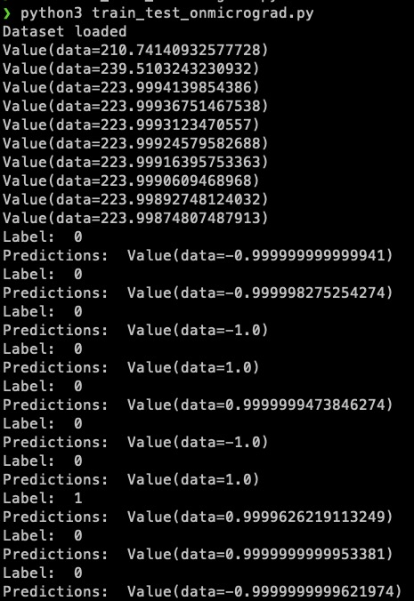

# micrograd

## Test

Tests individual micrograd func's one by one.

`python3 -m pytest -v`

## Test on MNIST

`python3 train_test_onmicrograd.py`

The func's are HIGHLY unoptimized for the MNIST :W 

## Experimenting and developing the micrograd

The notebook `experiment.ipynb` follows the video line by line.

## License

MIT
